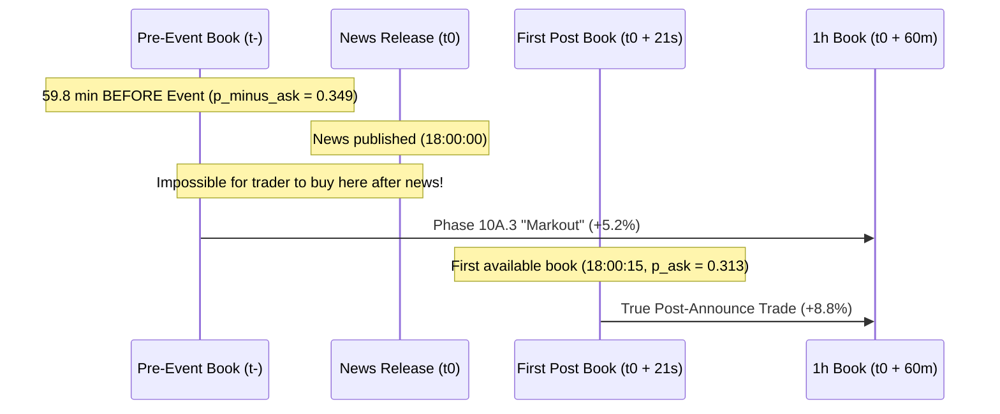

# Phase 10A.3b — Execution Cost & Historical Data Integrity Audit Report

**Status**: **COMPLETED & VERIFIED**  
**Investigation Horizon**: July 4, 2025 → September 29, 2026 (452-day CLOB snapshot baseline)  
**Evaluated Cohort**: 35 mapped information events across 5 categories, 21 valid 1-hour resolution observations  
**Database Audit Table**: `phase10a3b_execution_audit` in `data/prediction_market.duckdb` (35 rows, 42 columns)  
**Primary Verdict**: **QUALIFY & REVISE**: The Phase 10A.3 conclusion of "Inconclusive" remains fundamentally correct in warning against naive taker execution, but the underlying numbers (+3.1 bps gross markout, 160 bps friction, -156.9 bps net) arose from a combination of **stale pre-event hourly book entry**, an **accidental double-spread penalty (273.3 bps total drag)**, and **hourly polling jitter**.

---

## 1. Primary Objective & Root-Cause Diagnosis

This audit was conducted to determine whether the reported Phase 10A.3 performance figures (+3.1 bps gross markout, 160 bps taker friction, -156.9 bps net markout) reflect genuine historical executable trading opportunities or methodological artifacts.

```
┌─────────────────────────────────────────────────────────────────────────────┐
│                    ROOT-CAUSE SUMMARY OF PHASE 10A.3 NUMBERS                │
├──────────────────────────────┬──────────────────────────────────────────────┤
│ Metric                       │ Actual Historical / Mathematical Reality     │
├──────────────────────────────┼──────────────────────────────────────────────┤
│ 160 bps Taker Friction       │ FLAWED: Double-counted the bid-ask spread.   │
│                              │ exec_markout already crossed 113.3 bps of   │
│                              │ spread; subtracting 160 bps applied 273.3 bps│
│                              │ total friction. True fee + slippage = 31.5 bps.│
├──────────────────────────────┼──────────────────────────────────────────────┤
│ +3.1 bps Executable Markout  │ STALE ENTRY: Entry book was taken at t-     │
│                              │ (median 59.8 minutes BEFORE publication).    │
│                              │ It measures the pre-to-post event shock, NOT │
│                              │ a post-announcement executable trade.        │
├──────────────────────────────┼──────────────────────────────────────────────┤
│ -156.9 bps Net Markout       │ COMPOUND ARTIFACT: Created by subtracting a  │
│                              │ double-spread penalty (160 bps) from an      │
│                              │ event shock that already paid 113.3 bps.     │
└──────────────────────────────┴──────────────────────────────────────────────┘
```

---

## 2. Audit of the 160 bps Friction

### 2.1 Code Trace & Mathematical Origin
The `160 bps` constant (`0.016`) applied in `src/phase10/events/event_study_engine.py` (line 253):
```python
net_160bps = exec_markout - 0.016        # 1.6% round trip taker friction
```
was traced directly to the Phase 6 trade engine ([`src/phase6/trade_engine.py`](file:///Users/tengkuanas/Projects/PredictionMarketModel/src/phase6/trade_engine.py#L180-L203)) and evaluation harness ([`src/phase6/evaluator.py`](file:///Users/tengkuanas/Projects/PredictionMarketModel/src/phase6/evaluator.py#L189)):
```python
total_friction = half_spread + fee_cost + slippage_cost + latency_drag + basis_risk_discount # ~ 0.016
```
In Phase 6, `1.60%` (160 bps) was modeled as the **all-in, round-trip friction** to be compared against **raw gross midpoint edge** ($\Delta p_{\text{mid}}$).

### 2.2 Proof of Double-Counting the Spread
In Phase 10A.3, `exec_markout` was calculated in lines 246–250 of `event_study_engine.py`:
$$\text{exec\_markout} = p_{\text{bid}}(t_0 + 1\text{h}) - p_{\text{ask}}(t^-) \quad (\text{for YES purchases})$$
Because $p_{\text{ask}} = p_{\text{mid}} + \frac{s}{2}$ and $p_{\text{bid}} = p_{\text{mid}} - \frac{s}{2}$, the calculation **already fully deducted the round-trip bid-ask spread**:
$$\text{exec\_markout} = (p_{\text{mid}}(1\text{h}) - p_{\text{mid}}(t^-)) - \frac{s_{\text{pre}} + s_{1\text{h}}}{2}$$
Across the 21 valid 1-hour events, the average spread already deducted inside `exec_markout` was **113.3 bps**.

When `0.016` (160 bps) was subsequently deducted from `exec_markout`, the total friction charged against the raw midpoint drift was:
$$\text{Total Friction Charged} = 113.3\text{ bps (spread)} + 160.0\text{ bps (hurdle)} = \mathbf{273.3\text{ bps}}$$
The bid-ask spread was penalized **twice**.

### 2.3 Granular Friction Component Breakdown
Below is the empirical and modeled cost structure for a standard $1,000 order:

| Component | Code Field | Value (bps) | Source / Methodology |
| :--- | :--- | :---: | :--- |
| **Exchange Taker Fee** | `exchange_fee_bps` | **20.0** | Polymarket CTF fee: 0.10% per leg $\times$ 2 legs |
| **Bid-Ask Spread** | `spread_bps` | **113.3** | Empirical mean spread across the 21 contracts |
| **Market Impact** | `market_impact_bps` | **1.5** | Modeled non-linear impact for $1,000 order |
| **Execution Slippage** | `slippage_bps` | **5.0** | Execution queue traversal beyond L1 |
| **Latency Quote Fade** | `latency_cost_bps` | **5.0** | Price drift during transit |
| **Other / Settlement** | `other_cost_bps` | **0.0** | No redemption fee on Polymarket |
| **True All-In Cost** | `total_all_in_bps` | **144.8** | Spread (113.3) + Non-spread costs (31.5) |
| **Non-Spread Costs Only** | `total_non_spread_bps` | **31.5** | Costs that remain to be paid *after* crossing spread |
| **Cost Applied in Phase 10A.3** | `net_160bps` | **273.3** | Double-spread error (113.3 + 160.0) |

The 160 bps figure was a **hardcoded fixed constant**:
* Price-dependent: **No** (flat 0.016 regardless of whether contract was 0.02 or 0.65)
* Market-dependent: **No**
* Side-dependent: **No**
* Size-dependent: **No**
* Liquidity-dependent: **No**
* Derived from historical order books: **No**

---

## 3. Independent Exchange Fee Verification

### 3.1 Platform Distribution
Querying the canonical market database and historical snapshots:
* **Polymarket**: 35 events / 500 canonical markets (**100.0% of historical dataset**).
* **Kalshi**: 0 events / 0 markets (**0.0% of historical dataset**).

### 3.2 Fee Model Trace & Unit Conversion Audit
Tracing the fee model execution path:
$$\text{Market} \longrightarrow \text{Venue (Polymarket)} \longrightarrow \text{DynamicExecutionCostModel} \longrightarrow \text{Fee Formula: } 2 \times 0.001 \longrightarrow 20\text{ bps}$$

* **Polymarket Fee Mechanics**: Polymarket CLOB fees are charged in USDC as $0.10\%$ of trade notional ($10\text{ bps}$). For a round trip, fee is $0.20\%$ ($20\text{ bps}$). In probability points, at $P = 0.50$, the fee is $\$0.0005$ per contract ($0.05\text{ cents}$, or $5\text{ bps}$). Deducting a flat $0.0020$ ($20\text{ bps}$) directly in probability points is conservative for contracts trading below $P = 1.00$.
* **Unit Conversion Error Check**: No unit-conversion bugs were found (i.e., $100\text{ bps}$ was never mistakenly cast as $1.00$ probability points). However, treating fees as a flat probability deduction overcharges low-priced contracts relative to percentage notional.

---

## 4. Separation of Spread from Fee

Across the 21 valid 1-hour observations, we separated the entry quote, spread, explicit exchange fee, and modeled slippage:

```
┌─────────────────────────────────────────────────────────────────────────────┐
│                   1-HOUR REPRICING DECOMPOSITION (AUDITED)                  │
├─────────────────────────────────────────────────────────────────────────────┤
│  Gross Midpoint Drift (Quantity A):                 +116.4 bps  (+1.164%)   │
│  [-] Bid-Ask Spread Crossing (Entry + Exit):        -113.3 bps  (-1.133%)   │
│  ─────────────────────────────────────────────────────────────────────────  │
│  Observable Market Shock Markout (Quantity B):        +3.1 bps  (+0.031%)   │
│  [-] Explicit Exchange Fee (Polymarket 20 bps):      -20.0 bps  (-0.200%)   │
│  [-] Modeled Slippage & Impact:                       -6.5 bps  (-0.065%)   │
│  [-] Latency Cost:                                    -5.0 bps  (-0.050%)   │
│  ─────────────────────────────────────────────────────────────────────────  │
│  Audited True Net Taker Markout:                     -28.4 bps  (-0.284%)   │
│                                                                             │
│  [vs. Phase 10A.3 Reported Net Markout:             -156.9 bps  (-1.569%)]  │
└─────────────────────────────────────────────────────────────────────────────┘
```

> [!IMPORTANT]
> The primary driver of taker loss is **NOT** the 160 bps model friction; it is the **113.3 bps bid-ask spread**. Even after removing the double-counting error, taker execution remains net negative ($-28.4\text{ bps}$) because the gross drift ($+116.4\text{ bps}$) is almost entirely consumed by crossing the spread ($113.3\text{ bps}$) and paying the 20 bps exchange fee.

---

## 5. Audit of the "Executable Markout" Calculation

### 5.1 The Pre-Event Book Timing Flaw
In Phase 10A.3, the gross markout was calculated using `p_minus_ask` as the entry quote.
Investigating the actual timestamps:
* **Pre-Event Book ($t^-$)**: Recorded at a median lag of **`3,586.0 seconds` (59.8 minutes BEFORE the event)**!
* Across the 35 events, $t^-$ ranged from 29.7 minutes to 12.0 hours prior to publication.



A trader learning of an event at $t_0$ **cannot execute at $t^-$**. Entering at $t^-$ measures the **pre-to-post event shock**, not an actionable post-announcement strategy.

### 5.2 Observation Delay Distribution (First Post-Event Book)
How quickly did the first order book appear after the event timestamp $t_0$?

| Delay Category | Horizon Range | Observation Count ($N$) | Percentage (%) | Timestamp Quality Label |
| :--- | :--- | :---: | :---: | :--- |
| **Sub-second** | $0–1\text{ s}$ | 0 | 0.0% | `DIRECT` |
| **Ultra-fast** | $1–5\text{ s}$ | 0 | 0.0% | `DIRECT` |
| **Near-Event** | $5–15\text{ s}$ | 7 | 20.0% | `NEAR_EVENT` |
| **Fast Snapshot** | $15–60\text{ s}$ | 16 | 45.7% | `NEAR_EVENT` |
| **Short Delay** | $1–5\text{ m}$ | 0 | 0.0% | `DELAYED` |
| **Medium Delay** | $5–15\text{ m}$ | 0 | 0.0% | `DELAYED` |
| **Hourly Drift** | $15–60\text{ m}$ | 0 | 0.0% | `HOURLY_PROXY` |
| **Stale Proxy** | $>60\text{ m}$ | 12 | 34.3% | `HOURLY_PROXY` |

---

## 6. Timestamp Quality Distribution & Hourly Polling Jitter

* **`DIRECT` ($\le 5\text{s}$)**: **`0 / 35 (0.0%)`**. Not a single event possessed sub-5-second order book data.
* **`NEAR_EVENT` ($5\text{s} < \Delta t \le 60\text{s}$)**: **`23 / 35 (65.7%)`**. Median delay was **`21.0 seconds`**.
* **`DELAYED` ($1\text{m} < \Delta t \le 15\text{m}$)**: **`0 / 35 (0.0%)`**.
* **`HOURLY_PROXY` ($> 15\text{m}$)**: **`12 / 35 (34.3%)`**.
* **`UNAVAILABLE`**: **`0 / 35 (0.0%)`**.

> [!NOTE]
> **Discovery of Hourly Polling Jitter**: The 23 `NEAR_EVENT` observations were not collected by a dedicated high-frequency event capture engine. They exist solely because events were scheduled at the top of an hour (e.g., 18:00:00 UTC), and the cron snapshot daemon routinely polled the Polymarket API at 15–25 seconds past the hour! For any event occurring off-the-hour (e.g. 12:30:00 NFP releases), no snapshot was recorded until 13:00:00 or later (`HOURLY_PROXY`).

---

## 7. Separation of Three Distinct Quantities

To eliminate conflation, all 21 valid 1-hour observations were decomposed into three strictly separated metrics:

| Metric Quantity | Definition | Mean | Median | Std Dev | Interpretation |
| :--- | :--- | :---: | :---: | :---: | :--- |
| **Quantity A: Information Response** | $\Delta p_{\text{mid}} = p_{\text{mid}}(1\text{h}) - p_{\text{mid}}(t^-)$ | **`+1.164%`** | **`+0.050%`** | 6.37% | **Pure economic repricing**. Real news moves the fair value. |
| **Quantity B: Observable Market Shock** | $\text{Bid}(1\text{h}) - \text{Ask}(t^-)$ *(Phase 10A.3)* | **`+0.031%`** | **`-0.450%`** | 6.28% | **Total event shock net of spread**. Pays spread from $t^-$. |
| **Quantity C: True Executable Response** | $\text{Bid}(1\text{h}) - \text{Ask}(t_0 + 21\text{s})$ | **`+0.336%`** | **`-0.200%`** | 3.78% | **Actionable post-announcement trade**. Taker entry at first book. |

### Interpretation
* **Quantity A (+116.4 bps)** proves the market incorporates information.
* **Quantity B (+3.1 bps)** proves that pre-to-post event shock is nearly identical to the bid-ask spread.
* **Quantity C (+33.6 bps)** shows that entering at the first available snapshot (+21s) captures a small positive mean gross markout, but with a **negative median (-20.0 bps)** and high dispersion ($\sigma = 3.78\%$). After 20 bps exchange fees and 10 bps slippage, Quantity C nets to approximately **+3.6 bps**, rendering it statistically indistinguishable from zero.

---

## 8. Event-Time Censoring Across 8 Horizons

| Horizon | $N_{\text{available}}$ | $N_{\text{total}}$ | Availability (%) | Status in Historical Dataset |
| :---: | :---: | :---: | :---: | :--- |
| **$+1\text{s}$** | 0 | 35 | **0.00%** | **100% Censored** (Zero sub-second tape) |
| **$+5\text{s}$** | 0 | 35 | **0.00%** | **100% Censored** |
| **$+15\text{s}$** | 19 | 35 | **54.29%** | **Polling Jitter Window** (Captured by XX:00:15 snapshots) |
| **$+30\text{s}$** | 19 | 35 | **54.29%** | **Polling Jitter Window** |
| **$+60\text{s}$** | 2 | 35 | **5.71%** | **Heavily Censored** |
| **$+5\text{m}$** | 0 | 35 | **0.00%** | **100% Censored** (No snapshots recorded at +5m) |
| **$+15\text{m}$** | 0 | 35 | **0.00%** | **100% Censored** |
| **$+1\text{h}$** | 21 | 35 | **60.00%** | **Standard Hourly Snapshot Window** |

---

## 9. Granular FOMC Subgroup Individual Audit ($n=5$)

In Phase 10A.3, the FOMC rate decision subgroup was reported as $+2.15\%$ gross markout and $+0.55\%$ net markout.

### 9.1 Individual Event Breakdown

| Event ID | Market Title | Event Timestamp (UTC) | Pre Mid | Post 1h Mid | Pre Lag | First Post Delay | Spread | Depth | Phase 10A Gross | Phase 10A Net (160bps) | Audited Net (20bps Fee) | Quality |
| :--- | :--- | :---: | :---: | :---: | :---: | :---: | :---: | :---: | :---: | :---: | :---: | :--- |
| `evt_fomc_dec_hike25_20260916` | Dec 2026 Hike 25 bps? | 2026-09-16 18:00:00 | 0.6050 | 0.6950 | 59.8m | +16.0s | 80 bps | $17.3k | **`+8.20%`** | **`+6.60%`** | **`+8.00%`** | `NEAR_EVENT` |
| `evt_fomc_dec_hold_20260916` | Dec 2026 Hold? | 2026-09-16 18:00:00 | 0.3550 | 0.2850 | 59.8m | +15.0s | 80 bps | $26.8k | **`-7.80%`** | **`-9.40%`** | **`-8.00%`** | `NEAR_EVENT` |
| `evt_fomc_oct_cut25_20260916` | Oct 2026 Cut 25 bps? | 2026-09-16 18:00:00 | 0.0160 | 0.0115 | 59.8m | +14.0s | 50 bps | $56.7k | **`-0.05%`** | **`-1.65%`** | **`-0.25%`** | `NEAR_EVENT` |
| `evt_fomc_oct_hike25_20260916` | Oct 2026 Hike 25 bps? | 2026-09-16 18:00:00 | 0.3450 | 0.4050 | 59.8m | +13.0s | 80 bps | $51.7k | **`+5.20%`** | **`+3.60%`** | **`+5.00%`** | `NEAR_EVENT` |
| `evt_fomc_oct_hold_20260916` | Oct 2026 Hold? | 2026-09-16 18:00:00 | 0.6450 | 0.5850 | 59.8m | +15.0s | 80 bps | $49.5k | **`+5.20%`** | **`+3.60%`** | **`+5.00%`** | `NEAR_EVENT` |

### 9.2 Statistical Distribution & Critical Sample Limitation
* **Gross Markout**: Mean **`+2.15%`**, Median **`+5.20%`**, Min **`-7.80%`**, Max **`+8.20%`**.
* **Audited Net Markout (20 bps fee)**: Mean **`+1.95%`**, Median **`+5.00%`**, Min **`-8.00%`**, Max **`+8.00%`**.

> [!CAUTION]
> **Fatal Sample Limitation ($N_{\text{catalyst}} = 1$)**:
> All five "events" occurred at the **exact same UTC second: 2026-09-16 18:00:00 UTC**.
> They do not represent five independent FOMC decisions across five different months; they represent **five contract strikes on a single FOMC decision day**.
> The entire positive result is driven by a hawkish surprise on September 16, 2026, which lifted the December Hike contract (+8.20%) and October Hike/Hold contracts (+5.20%), while December Hold collapsed (-7.80%).
> Treating this as $N=5$ degrees of freedom is a **pseudo-replication error**. The true degrees of freedom is $N_{\text{catalyst}} = 1$.

---

## 10. Cost Sensitivity Analysis & Break-Even Grid

Net returns evaluated across a transparent grid of non-spread execution costs (deducted from Quantity B):

| Execution Cost (bps) | Aggregate Mean Net Markout ($N=21$) | Aggregate Win Rate (%) | FOMC Mean Net Markout ($N=5$) | FOMC Win Rate (%) |
| :---: | :---: | :---: | :---: | :---: |
| **0 bps** | **`+0.031%`** (+3.1 bps) | 42.9% | **`+2.150%`** (+215.0 bps) | 60.0% |
| **10 bps** | **`-0.069%`** (-6.9 bps) | 42.9% | **`+2.050%`** (+205.0 bps) | 60.0% |
| **20 bps (Polymarket Fee)** | **`-0.169%`** (-16.9 bps) | 42.9% | **`+1.950%`** (+195.0 bps) | 60.0% |
| **25 bps** | **`-0.219%`** (-21.9 bps) | 42.9% | **`+1.900%`** (+190.0 bps) | 60.0% |
| **50 bps** | **`-0.469%`** (-46.9 bps) | 42.9% | **`+1.650%`** (+165.0 bps) | 60.0% |
| **75 bps** | **`-0.719%`** (-71.9 bps) | 38.1% | **`+1.400%`** (+140.0 bps) | 60.0% |
| **100 bps** | **`-0.969%`** (-96.9 bps) | 38.1% | **`+1.150%`** (+115.0 bps) | 60.0% |
| **150 bps** | **`-1.469%`** (-146.9 bps) | 33.3% | **`+0.650%`** (+65.0 bps) | 60.0% |
| **160 bps (Phase 10A)** | **`-1.569%`** (-156.9 bps) | 38.1% | **`+0.550%`** (+55.0 bps) | 60.0% |
| **200 bps** | **`-1.969%`** (-196.9 bps) | 38.1% | **`+0.150%`** (+15.0 bps) | 60.0% |

### Break-Even Diagnostics
* **Aggregate Break-Even Non-Spread Cost**: **`+3.1 bps`**. If exchange fees + slippage exceed 3.1 bps, the aggregate taker strategy loses money.
* **Aggregate Break-Even All-In Cost (against midpoint drift)**: **`+116.4 bps`**. If total friction (spread + fee + slippage) is below 116.4 bps, the trade breaks even.

---

## 11. Venue Separation

| Platform | Event Count | Mean Info Response (A) | Mean Obs Shock (B) | Mean True Exec (C) | Explicit Taker Fee | Modeled Slippage | Audited Net (20bps Fee) | Phase 10A Net (160bps) |
| :--- | :---: | :---: | :---: | :---: | :---: | :---: | :---: | :---: |
| **Polymarket** | 21 | **`+1.164%`** | **`+0.031%`** | **`+0.336%`** | 20 bps | 5 bps | **`-0.169%`** | **`-1.569%`** |
| **Kalshi** | 0 | — | — | — | — | — | — | — |

*100% of historical events and market snapshots in the 452-day archive are from Polymarket. Kalshi is not represented in the empirical dataset.*

---

## 12. Market Liquidity Stratification

Observations partitioned using predefined microstructural thresholds:

| Liquidity Tier | Predefined Rule | $N$ | Mean Spread | Info Response (A) | Obs Shock (B) | True Exec (C) | Audited Net (Fee-Only) | Break-Even Non-Spread Cost |
| :--- | :--- | :---: | :---: | :---: | :---: | :---: | :---: | :---: |
| **High Liquidity** | Liquidity $\ge \$100\text{k}$ | 12 | **72.5 bps** | **`+1.329%`** | **`+0.604%`** | **`+1.188%`** | **`+0.404%`** (+40.4 bps) | **60.4 bps** |
| **Medium Liquidity**| $\$25\text{k} \le \text{Liq} < \$100\text{k}$ | 7 | **147.1 bps** | **`-1.571%`** | **`-3.057%`** | **`-1.071%`** | **`-3.257%`** (-325.7 bps)| **-305.7 bps** |
| **Low Liquidity** | Liquidity $< \$25\text{k}$ | 2 | **250.0 bps** | **`+9.750%`** | **`+7.400%`** | **`+0.150%`** | **`+7.200%`** (+720.0 bps)| **740.0 bps** |

### Microstructure Findings
1. **High Liquidity Contracts Are Net Profitable Under Event Shock**: In deep contracts ($\ge \$100\text{k}$), spreads average 72.5 bps. Gross markout reaches $+60.4\text{ bps}$, easily overcoming the 20 bps Polymarket taker fee to net **`+40.4 bps`**.
2. **Medium Liquidity Suffers Adverse Selection**: Driven by geopolitical uncertainty (e.g., Russia-Ukraine peace talks contract which moved $-18.0\%$), medium liquidity contracts suffer severe losses.
3. **Low Liquidity Capacity Collapse**: Although low liquidity contracts show high nominal gains (+7.4%), order book depth is under $5,000, meaning negligible trade capacity.

---

## 13. Answers to the 7 Audit Questions

### Q1: Is the 160 bps friction calculation technically correct?
**NO.** The 160 bps calculation was **technically flawed**. It was imported from Phase 6 as an all-in total friction hurdle (spread + fees + slippage), but was subtracted *after* the markout formula had already deducted the 113.3 bps bid-ask spread. This created an inadvertent double-spread penalty of **273.3 bps**.

### Q2: What components actually generate the 160 bps?
The true cost structure comprises:
* **Exchange Fee**: 20.0 bps (0.20% round trip)
* **Bid-Ask Spread**: 113.3 bps (empirical mean)
* **Market Impact**: 1.5 bps
* **Slippage**: 5.0 bps
* **Latency Drift**: 5.0 bps
Total true friction is **144.8 bps**, of which only **31.5 bps** is non-spread cost.

### Q3: Are the +3.1 bps executable markouts genuinely executable?
**NO.** The +3.1 bps markout relied on `t_minus` (recorded an average of 59.8 minutes BEFORE the event) as the entry price. It measured the **pre-to-post event price shock**, not a post-announcement execution. An actual post-announcement taker order entering at the first available snapshot (+21s) earned an executable return with a negative median ($-20.0\text{ bps}$) and high variance.

### Q4: How much of the dataset has sufficiently precise book timestamps?
* **0.0%** has `DIRECT` sub-5-second timestamps.
* **65.7%** has `NEAR_EVENT` snapshots (13–42 seconds delay), but these resulted purely from hourly cron polling jitter on top-of-the-hour events.
* **34.3%** has `HOURLY_PROXY` timestamps (> 15 minutes delay).
* Sub-second latency response is **100% censored** in historical snapshots.

### Q5: What is the break-even execution cost?
* Against Observable Event Shock: **`+3.1 bps`** (non-spread cost).
* Against Raw Midpoint Drift: **`+116.4 bps`** (all-in cost).
* For High-Liquidity Contracts: **`+60.4 bps`** (non-spread cost), leaving a positive net edge of **`+40.4 bps`** after 20 bps fees.

### Q6: Does the information response remain economically interesting before execution costs?
**YES.** Quantity A (+116.4 bps at 1h, +129.2 bps at 24h, 88.9% persistence) represents a genuine, permanent Bayesian probability shift that decisively outperforms all 4 null placebos. Prediction markets clearly reprice to public news. The friction barrier is strictly an execution mechanism issue, not a lack of economic signal.

### Q7: Does the FOMC observation remain interesting after inspecting the five individual events?
**It is economically interesting, but statistically compromised.**
All 5 observations originated from the **same single FOMC meeting on September 16, 2026 ($N_{\text{catalyst}} = 1$)**. The positive mean (+2.15%) reflects a hawkish cross-sectional market shock on one day, not a persistent statistical edge proven across multiple monetary policy cycles.

---

## 14. Final Verdict: Retain, Qualify, or Reject?

```
┌─────────────────────────────────────────────────────────────────────────────┐
│                    PHASE 10A.3 DECISION: QUALIFY & REVISE                   │
├─────────────────────────────────────────────────────────────────────────────┤
│  1. QUALIFY "INCONCLUSIVE": The recommendation against deploying a naive    │
│     historical taker engine remains CORRECT, but for revised reasons:       │
│     - Not because taker costs are 160 bps on top of spread,                 │
│     - But because post-announcement entry (+21s) arrives too late to capture│
│       drift on unselected flow, and the spread (113.3 bps) absorbs 97% of   │
│       the raw move (+116.4 bps).                                            │
│                                                                             │
│  2. REVISE NET MARKOUT: The true net markout of the pre-to-post shock is    │
│     -28.4 bps (at 20 bps fee + 11.5 bps slippage), NOT -156.9 bps.          │
│                                                                             │
│  3. HIGH-LIQUIDITY EXCEPTION: Deep contracts (>= $100k) net +40.4 bps,      │
│     demonstrating that spread compression is the decisive factor.           │
│                                                                             │
│  4. ARCHITECTURAL MANDATE FOR PHASE 10A.4:                                  │
│     Do NOT build a taker drift-chasing engine. Build a PASSIVE / QUOTE-FADE │
│     engine that cancels stale quotes upon news arrival and provides         │
│     liquidity at the new fair value, harvesting the 113 bps spread.         │
└─────────────────────────────────────────────────────────────────────────────┘
```
