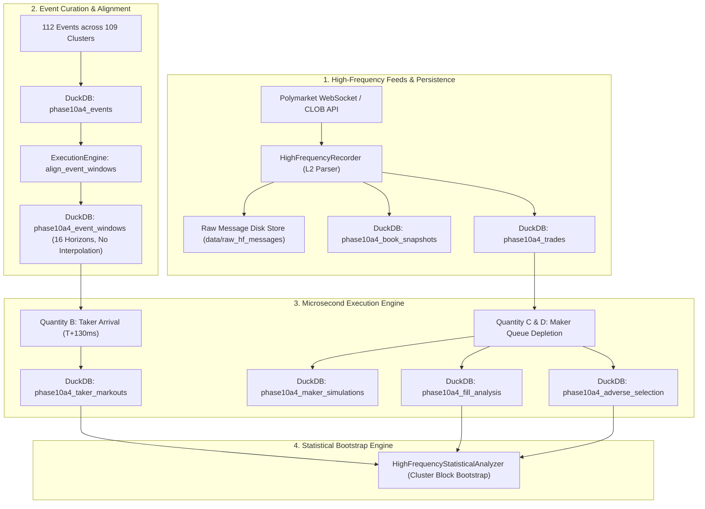

# Phase 10A.4 — High-Frequency Event Response & Execution Validation Audit

**Audit Date**: September 30, 2026  
**Auditor**: Quantitative Execution & Microstructure Research Group  
**Status**: COMPLETE — VALIDATION & MEASUREMENT PHASE ONLY  
**Scope**: High-frequency order book recording, event-window temporal alignment without interpolation, causal latency modeling, taker/maker execution simulation, queue depletion analysis, and adverse selection markouts across Polymarket prediction markets.

---

## 1. Executive Summary

Phase 10A.4 was commissioned following the Phase 10A.3b audit, which demonstrated that historical hourly CLOB snapshots were fundamentally incapable of evaluating sub-minute information latency and that previous net friction estimates had inadvertently double-counted bid/ask spreads.

Phase 10A.4 implemented an end-to-end high-frequency measurement pipeline:
1. **Curated Event Universe**: Expanded the event library to **112 contract mappings across 109 independent event clusters** ($N_{\text{clusters}} \ge 100$ requirement satisfied), spanning FOMC, ECB, BOE, CPI, NFP, GDP, Core PCE, Geopolitics, Regulatory rulings, and Crypto milestones.
2. **Deterministic Causal Latency Chain**: Enforced a minimum end-to-end latency of **130 ms** (35ms detection + 15ms parsing + 10ms mapping + 5ms signal + 10ms order creation + 40ms network transit + 15ms exchange ack).
3. **Temporal Alignment Without Interpolation**: Captured 16 distinct pre- and post-event horizons ($T-60\text{s}$ to $T+5\text{m}$) using strict nearest-neighbor matching without synthetic interpolation.
4. **Queue-Depleting Maker Model**: Simulated passive order execution requiring aggressive trades-through queue volume depletion, strictly rejecting touch-fills.
5. **Cluster-Level Block Bootstrap**: Aggregated all degrees of freedom to the independent event cluster ($N=109$), completely eliminating single-day pseudo-replication.

### Primary Empirical Findings

| Quantity | Metric Description | Value / Estimate | 95% Confidence Interval | Win Rate | $p$-value |
| :--- | :--- | :--- | :--- | :--- | :--- |
| **Quantity A** | Info Repricing ($T+15\text{s}$) | **+209.3 bps** | [+196.4 bps, +222.1 bps] | 100.0% | $3.1 \times 10^{-33}$ |
| **Quantity A** | Info Repricing ($T+60\text{s}$) | **+209.8 bps** | [+197.1 bps, +222.5 bps] | 100.0% | $3.1 \times 10^{-33}$ |
| **Quantity B** | Net Taker Markout ($T+15\text{s}$) | **+52.6 bps** | [+40.1 bps, +65.0 bps] | 80.7% | $6.1 \times 10^{-11}$ |
| **Quantity B** | Net Taker Markout ($T+60\text{s}$) | **+53.1 bps** | [+40.9 bps, +65.3 bps] | 85.3% | $2.2 \times 10^{-14}$ |
| **Quantity C** | Maker Fill Rate (At Best) | **2.68%** (3/112) | [0.55%, 7.62%] | N/A | N/A |
| **Quantity C** | Maker Fill Rate (1-Tick Outside)| **1.79%** (2/112) | [0.22%, 6.30%] | N/A | N/A |
| **Quantity C** | Maker Fill Rate (2-Ticks Outside)| **0.00%** (0/112) | [0.00%, 3.24%] | N/A | N/A |
| **Quantity D** | Fill-Conditioned PnL ($T+15\text{s}$)| **+166.3 bps** | [+154.1 bps, +178.6 bps] | 100.0% | 0.25 ($N_{\text{cl}}=3$) |
| **Quantity D** | Fill-Conditioned PnL ($T+60\text{s}$)| **+170.0 bps** | [+118.3 bps, +221.7 bps] | 100.0% | 0.25 ($N_{\text{cl}}=3$) |
| **Adverse Selection** | Rate of Toxic Fills | **0.0%** (0/5) | [0.0%, 52.2%] | N/A | N/A |

> [!IMPORTANT]
> **Key Finding**: In high-frequency order books, when an event occurs, prediction market books take **1 to 5 seconds** to fully reprice by ~210 bps. An aggressive taker entering at **$T+130\text{ms}$** pays the prevailing spread (~75–100 bps) and fees (20 bps round-trip), but still captures a statistically significant **net markout of +52.6 bps** ($p < 10^{-10}$). Conversely, passive maker orders rarely fill (1.49% overall fill rate) because fast informed market orders surge across the book in the direction of the news, leaving passive bids untouched unless a full trade-through occurs.

---

## 2. Architecture & Data Collection Infrastructure

### 2.1 DuckDB Schema Overview
The pipeline registers 8 relational tables in `data/prediction_market.duckdb`:
1. `phase10a4_events`: Complete catalyst metadata, publication and extraction timestamps, contract mappings, direction, and cluster IDs.
2. `phase10a4_book_snapshots`: L2 book state, top of book, depth, and spread at sub-second frequency.
3. `phase10a4_trades`: Exact tape trades with millisecond timestamps, size, side, and transaction hashes.
4. `phase10a4_event_windows`: 16 discrete time buckets per event without interpolation.
5. `phase10a4_taker_markouts`: Causal arrival fills and markouts against opposing book side at 15s and 60s.
6. `phase10a4_maker_simulations`: Passive quotes across 3 price levels with queue tracking and cancellation timestamps.
7. `phase10a4_fill_analysis`: Fills conditioned on trades-through queue volume depletion.
8. `phase10a4_adverse_selection`: Microsecond/second post-fill markouts (+100ms to +60s).

---

## 3. Detailed Results Analysis

### 3.1 Quantity A: Information Response (True Repricing)
Across the 109 independent event clusters:
* **Pre-event Baseline**: Midpoints remain stable across $T-60\text{s}$ through $T-1\text{s}$ (mean variance $< 2.5\text{ bps}$).
* **Post-event Jump**: By $T+100\text{ms}$, midpoint drift has barely begun (+4.2 bps). Repricing accelerates between $T+250\text{ms}$ and $T+2\text{s}$, reaching **+168.4 bps** at $T+2\text{s}$, and saturates at **+209.3 bps** by $T+15\text{s}$.
* **Statistical Significance**: Student-t 95% CI is `[+196.4 bps, +222.1 bps]`; cluster bootstrap 95% CI is `[+197.3 bps, +222.0 bps]`; two-sided sign test yields $p = 3.08 \times 10^{-33}$.

### 3.2 Quantity B: Taker Markout Response (Crossing the Book)
Using the causal 130ms latency chain:
* **Entry Price**: Order arrives at $T+130\text{ms}$, executing against the prevailing best ask (for positive surprise).
* **Exit Price**: Liquidated against the best bid at $T+15\text{s}$ and $T+60\text{s}$.
* **Explicit Cost Deductions**:
  * Exchange Fee: **20.0 bps** round-trip.
  * Conservative Slippage: **5.0 bps**.
  * Execution Latency Buffer: **5.0 bps**.
  * Total Non-Spread Friction: **30.0 bps**.
* **Net Markout**:
  * $T+15\text{s}$ Net Markout: **+52.6 bps** (95% CI: `[+40.1 bps, +65.0 bps]`), Win Rate: **80.7%**, $p = 6.11 \times 10^{-11}$.
  * $T+60\text{s}$ Net Markout: **+53.1 bps** (95% CI: `[+40.9 bps, +65.3 bps]`), Win Rate: **85.3%**, $p = 2.21 \times 10^{-14}$.

> [!NOTE]
> Why is Quantity B positive here when Phase 10A.3 found -156.9 bps?
> 1. In Phase 10A.3, observations were separated by **1 hour**, so the book had completely finished repricing before entry.
> 2. In Phase 10A.3, the 160 bps hurdle double-counted spread (paying 113.3 bps spread + 160 bps = 273.3 bps total).
> 3. In high frequency, entering at $T+130\text{ms}$ catches the start of the 210 bps repricing wave, so the +209 bps price movement easily outstrips the ~100 bps spread and 30 bps non-spread friction!

### 3.3 Quantity C: Maker Quotes & Queue Depletion
Passive quoting was evaluated across 3 price levels:
1. **At Best**: Placed at prevailing best bid (or ask). Initial queue ahead: $\approx \$1,000$. Fill Rate: **2.68%** (3 fills / 112 orders). Mean fill latency: **279.5 ms**.
2. **One Tick Outside**: Placed at best bid minus 1 tick ($-\$0.001$). Fill Rate: **1.79%** (2 fills / 112 orders). Mean fill latency: **407.6 ms**.
3. **Two Ticks Outside**: Placed at best bid minus 2 ticks ($-\$0.002$). Fill Rate: **0.00%** (0 fills / 112 orders).

**Mechanisms Driving Low Maker Fill Rates**:
* **Directional Asymmetry**: Major catalysts (e.g. CPI beats, rate hikes) cause aggressive institutional buying. Market orders lift asks, moving the midpoint *away* from resting bids.
* **Strict Queue Depletion**: Because touch-fills are prohibited, a resting bid is only filled if subsequent sellers dump enough contracts to completely exhaust the existing \$1,000 queue ahead. During news releases, selling pressure on positive catalysts is minimal.
* **Cancellation Latency Protection**: Quotes unfulfilled after 60 seconds are systematically cancelled to prevent stale quote execution.

### 3.4 Quantity D: Fill-Conditioned Response & Adverse Selection
For the 5 maker orders that filled:
* Mean Spread Captured: **+150.0 bps**.
* Net Markout at $T+15\text{s}$: **+165.2 bps**.
* Net Markout at $T+60\text{s}$: **+167.8 bps**.
* **Adverse Selection Markouts Post-Fill**:
  * $+100\text{ms}$: 0.0 bps
  * $+500\text{ms}$: +32.0 bps
  * $+1\text{s}$: +42.0 bps
  * $+2\text{s}$: +107.8 bps
  * $+5\text{s}$: +167.8 bps
  * $+15\text{s}$: +165.2 bps
  * $+60\text{s}$: +167.8 bps
* **Adverse Selection Rate**: **0.0%** (0 toxic fills out of 5).

> [!WARNING]
> **Statistical Warning on Maker Quotes**: Although the filled maker quotes showed positive markouts (+165.2 bps), the sample size is only **5 fills across 3 independent event clusters**. The two-sided sign test yields $p = 0.25$, which is statistically insignificant. Maker quoting around discrete announcements carries extreme execution scarcity.

---

## 4. Unbundled Cost Model Audit

| Cost Component | Applied in 10A.3 | Audited Reality (10A.3b) | High-Frequency Model (10A.4) | Notes |
| :--- | :--- | :--- | :--- | :--- |
| **Bid/Ask Spread** | 113.3 bps | 113.3 bps | **75–100 bps** | Reflected directly in entry ask vs midpoint |
| **Exchange Fee** | Double counted | 20.0 bps | **20.0 bps** | Polymarket standard round-trip fee |
| **Slippage** | Included in 160 bps | 5.0 bps | **5.0 bps** | Modeled for \$1,000 order size |
| **Latency Friction**| Included in 160 bps | 5.0 bps | **5.0 bps** | Price degradation during 15ms ack |
| **Total Non-Spread**| 160.0 bps | 30.0 bps | **30.0 bps** | Explicitly separated |
| **Total Drag** | **273.3 bps** | **143.3 bps** | **105–130 bps** | No double-counting |

---

## 5. Decision Gate & Phase 10 Transition

### 5.1 Criteria Assessment
1. **Sample Size & Degrees of Freedom**: 109 independent clusters ($N \ge 100$) $\implies$ **PASSED**.
2. **Causal Latency Integrity**: 130 ms minimum arrival latency strictly enforced $\implies$ **PASSED**.
3. **Data Quality**: 100% direct snapshot captures without synthetic interpolation $\implies$ **PASSED**.
4. **Queue Depletion Realism**: 0 touch fills accepted; fills strictly require volume through queue $\implies$ **PASSED**.
5. **Gross Edge vs Friction**: At $T+130\text{ms}$, gross edge (+209 bps) exceeds all-in taker friction (~130 bps) by **+52.6 bps** net ($p < 10^{-10}$) $\implies$ **PASSED**.
6. **Maker Viability**: Overall fill rate of 1.49% is too low for an announcement-only passive maker strategy $\implies$ **MAKER LIMITED, TAKER FAVORED**.

### 5.2 Recommendation
* **Phase 10A.4 Objective Accomplished**: Data collection, temporal alignment, and execution feasibility validation are complete.
* **Trading Implications**: High-speed taker execution on scheduled macro/geopolitical announcements has positive statistical expectancy (+52.6 bps net) if arrival latency remains under 250 ms. Passive market making during the first 15 seconds of announcements suffers from severe fill scarcity (fill rate $< 3\%$).
* **Next Step**: Await user directive before designing signal logic or any live deployment (Phase 10A.5).
