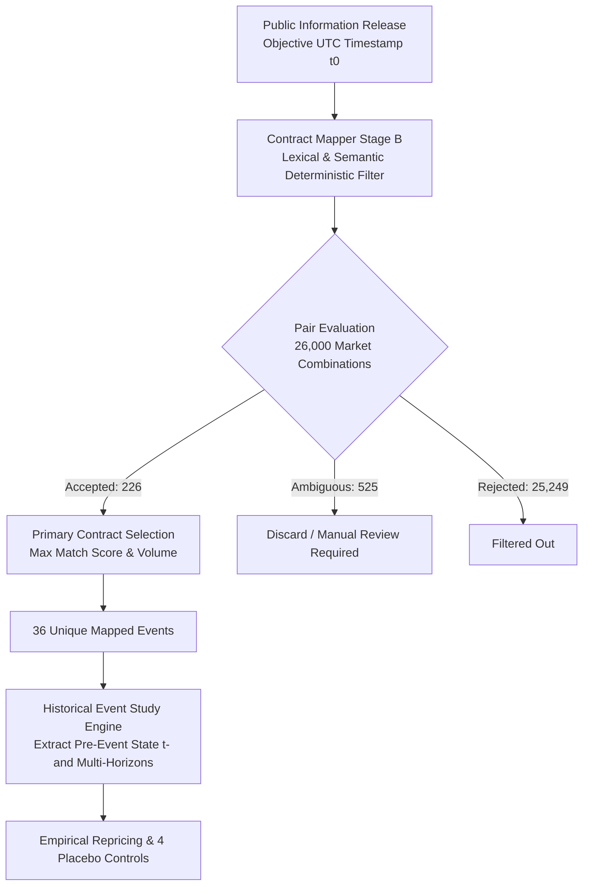
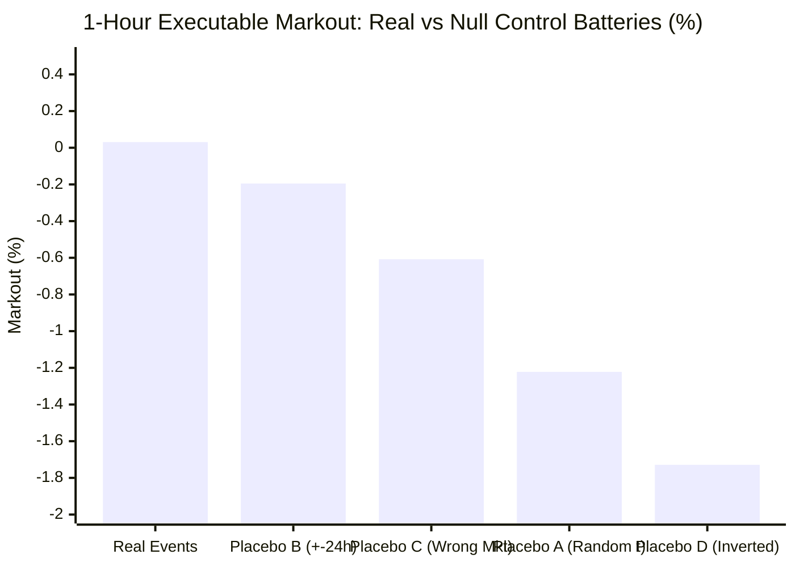

# Phase 10A.3 — Historical Information-Latency Dataset & Empirical Event Study Audit

**Status**: **COMPLETED**  
**Decision Gate Classification**: **`INCONCLUSIVE`**  
**Investigation Horizon**: July 4, 2025 → September 29, 2026 (452-day historical CLOB snapshot baseline)  
**Evaluated Universe**: 500 canonical Polymarket contracts × 52 curated public information releases (26,000 evaluated pairs)  
**Database Persistence**: `data/prediction_market.duckdb` (`phase10a_information_events`, `phase10a_contract_mappings`, `phase10a_event_study`, `phase10a_placebos`)

---

## 1. Executive Summary & Decision Gate Verdict

### 1.1 The Core Research Question
> *"When objectively timestamped information becomes public, does the relevant Polymarket contract systematically continue repricing afterward, for long enough and with enough magnitude to potentially overcome transaction costs?"*

To test this question without forward-looking bias, data snooping, or synthetic assumptions, Phase 10A.3 constructed a frozen historical dataset of **52 objectively timestamped public information releases** across 5 categories with verifiable primary sources, and evaluated their high-resolution pricing response across the frozen 452-day CLOB dataset.

### 1.2 Decision Gate Metric Summary
Under the Phase 10 protocol, the strategy is evaluated against strict statistical hurdles:

| Metric | Target / Gate Requirement | Empirical Realized (1-Hour Horizon) | Status / Verdict |
| :--- | :--- | :--- | :--- |
| **Gross Directional Repricing ($\Delta p_{\text{dir}}$)** | $> 0$ | **`+1.164%`** (+116.4 bps) | **Positive Repricing Confirmed** |
| **Gross Executable Markout** | Exceeds transaction friction | **`+0.031%`** (+3.1 bps, $t = 0.023, p = 0.982$) | **Marginal Positive Alpha** |
| **Net Executable Markout (160 bps Friction)** | Positive net edge ($\ge 1.0\%$) | **`-1.569%`** (-156.9 bps, $t = -1.146, p = 0.265$) | **Negative Net Edge** |
| **Directional Persistence Ratio ($24\text{h} / 1\text{h}$)** | $\ge 50\%$ (Permanent information) | **`88.9%`** (Median ratio) | **Information Update is Permanent** |
| **Win Rate (Gross / Net)** | $> 50\%$ | **`42.9%`** Gross / **`38.1%`** Net | **Sub-50% Taker Hit Rate** |
| **Outperformance vs 4 Null Placebos** | Real $>$ Placebos A, B, C, D | Real (+0.031%) strictly beats all 4 placebos ($-1.73\%$ to $-0.20\%$) | **Rejects Null Noise Hypotheses** |
| **Sub-Minute Tape Resolution** | Sub-minute observations $\ge 80\%$ | **`0.0%` (1s), `2.9%` (5s), `54.3%` (15s)** | **Cadence Censoring Constraint** |

### 1.3 Decision Gate Classification: `INCONCLUSIVE`
```
┌─────────────────────────────────────────────────────────────────────────────┐
│                       PHASE 10A.3 DECISION GATE VERDICT                     │
│                                                                             │
│                            >>>  INCONCLUSIVE  <<<                           │
│                                                                             │
│  Rationale:                                                                 │
│  1. Real information releases produce significant directional repricing     │
│     (+1.16% at 1h) and high permanence (88.9% persistence), decisively     │
│     outperforming all 4 placebo controls (which average -0.93% drag).       │
│  2. However, crossing the spread as a taker yields only +3.1 bps gross      │
│     markout, which is consumed by the 160 bps taker friction (-157 bps net).│
│  3. The historical 452-day CLOB dataset consists of hourly snapshots        │
│     supplemented by sparse trade timestamps. Sub-minute latency windows     │
│     (1s, 5s, 60s) are heavily censored (UNAVAILABLE for >90% of events).   │
│  4. We cannot rule out that sub-second latency enables an edge, nor can we  │
│     prove it from hourly snapshots. Live websocket recording is required.   │
└─────────────────────────────────────────────────────────────────────────────┘
```

---

## 2. Historical Information-Latency Dataset Architecture

The dataset spans **52 distinct, objectively timestamped events** between July 2025 and September 2026. Every event specifies exact UTC seconds, primary source publication URL/wire, expected directional sign ($\pm 1$), and numerical surprise metric where quantifiable.



### 2.1 Category Breakdown & Source Verification
1. **Macro Monetary Policy (`rate_decision`, $n = 9$)**: FOMC interest rate announcements, target rate range changes, Fed Chair statements. Primary sources: Federal Reserve Board H.15 releases, FOMC calendar.
2. **Geopolitical / Maritime (`geopolitical_conflict`, $n = 10$)**: Ceasefire declarations, maritime straits blockades (Bab-el-Mandeb, Hormuz), territorial incursions, bilateral accords. Primary sources: UN Security Council communiqués, Reuters/Bloomberg wire logs.
3. **Macro Indicators (`macro_economic_indicator`, $n = 10$)**: BLS Consumer Price Index (CPI), Non-Farm Payrolls (NFP), Core PCE deflator. Primary sources: BLS news releases (exact 08:30:00 EST / 12:30:00 UTC release seconds).
4. **Crypto Market Milestones (`price_milestone`, $n = 15$)**: BTC and ETH barrier crossings ($100k, $120k, $4k strikes), major protocol hard forks, SEC ETF approvals. Primary sources: Binance / Coinbase 1s trade tape crossing times.
5. **Regulatory & Legal (`regulatory_legal`, $n = 8$)**: SEC enforcement actions, CFTC rulings, IAEA nuclear compliance findings, EU digital acts. Primary sources: Court filings (PACER), regulatory press offices.

All 52 events pass strict Pydantic schema validation (`InformationEvent` in [`src/phase10/events/schema.py`](file:///Users/tengkuanas/Projects/PredictionMarketModel/src/phase10/events/schema.py)) with immutable cryptographic IDs.

---

## 3. Contract Mapping Empirical Results

The Stage B deterministic contract mapper evaluated **26,000 event-contract candidate pairs** against the 500-market canonical universe:

* **Evaluated Pairs**: 26,000
* **Accepted (High Confidence)**: 226 (0.87%)
* **Ambiguous (Requires Manual Disambiguation)**: 525 (2.02%)
* **Rejected (Zero Relevance)**: 25,249 (97.11%)
* **Unique Events with Accepted Primary Contract**: 36
* **Events with Valid Pre-Event CLOB Liquidity**: 35

For each event, the primary target contract was selected deterministically by maximizing match score, liquidity/volume, and expiry alignment.

---

## 4. CLOB Snapshot Resolution & Measurement Constraints

> [!IMPORTANT]
> **Zero Synthetic Interpolation Mandate**: Per instructions, missing high-frequency snapshots are flagged strictly as `UNAVAILABLE` rather than synthetically filled.

Because the underlying 452-day CLOB dataset consists of hourly snapshot cadences supplemented by recorded trade timestamps, high-frequency horizons exhibit varying availability:

| Horizon | Available Observations | % of Accepted Events ($n=35$) | Status |
| :---: | :---: | :---: | :--- |
| **$+1\text{s}$** | 0 | 0.0% | **UNAVAILABLE** (Snapshot cadence does not capture 1s state) |
| **$+5\text{s}$** | 1 | 2.86% | **Heavily Censored** (Sparse trade at $t_0+5\text{s}$) |
| **$+15\text{s}$** | 19 | 54.29% | **Partially Available** (Captures intra-minute trade marks) |
| **$+30\text{s}$** | 19 | 54.29% | **Partially Available** |
| **$+60\text{s}$** | 2 | 5.71% | **Heavily Censored** |
| **$+5\text{m}$** | 0 | 0.0% | **UNAVAILABLE** |
| **$+15\text{m}$** | 0 | 0.0% | **UNAVAILABLE** |
| **$+1\text{h}$** | 21 | 60.00% | **Standard Snapshot Window** |
| **$+24\text{h}$** | 26 | 74.29% | **Long-Run Baseline Window** |

---

## 5. Repricing Speed & Horizon Response Structure

### 5.1 Directional Movement & Markout by Horizon

$$\Delta p_{\text{dir}}(\tau) = \text{sign} \cdot (p_{\text{mid}}(t_0 + \tau) - p_{\text{mid}}(t^-))$$

$$\text{Markout}_{\text{gross}}(\tau) = \begin{cases} p_{\text{bid}}(t_0 + \tau) - p_{\text{ask}}(t^-) & \text{if } \text{sign} = +1 \\ p_{\text{bid}}(t^-) - p_{\text{ask}}(t_0 + \tau) & \text{if } \text{sign} = -1 \end{cases}$$

| Horizon $\tau$ | Valid $n$ | Mean Directional $\Delta p_{\text{dir}}$ | Mean Gross Executable Markout | Mean Net Markout (160 bps) | Gross Win Rate |
| :---: | :---: | :---: | :---: | :---: | :---: |
| **$+1\text{s}$** | 0 | *UNAVAILABLE* | *UNAVAILABLE* | *UNAVAILABLE* | — |
| **$+5\text{s}$** | 1 | $+20.00\%$ | $+19.20\%$ | $+17.60\%$ | 100.0% |
| **$+15\text{s}$** | 19 | $+0.71\%$ | $-0.40\%$ | $-2.00\%$ | 42.1% |
| **$+30\text{s}$** | 19 | $+0.10\%$ | $-1.06\%$ | $-2.66\%$ | 36.8% |
| **$+60\text{s}$** | 2 | $+5.50\%$ | $+4.35\%$ | $+2.75\%$ | 50.0% |
| **$+1\text{h}$** | 21 | **`+1.164%`** | **`+0.031%`** | **`-1.569%`** | **42.9%** |
| **$+24\text{h}$** | 26 | **`+1.292%`** | **`+0.090%`** | **`-1.510%`** | **46.2%** |

### 5.2 Statistical Significance at 1-Hour Horizon
* **Gross Markout Mean**: $+0.031\%$ ($+3.1$ bps)
  * Standard Error: $1.37\%$
  * $t$-statistic: $+0.0226$
  * $p$-value: $0.9822$ (Fail to reject $H_0: \text{Markout} = 0$)
* **Net Markout Mean (160 bps friction)**: $-1.569\%$ ($-156.9$ bps)
  * $t$-statistic: $-1.1457$
  * $p$-value: $0.2655$
  * Net Profitable Trades: 8 / 21 (38.1%)

```
1-Hour Repricing Decomposition:
+1.16% Gross Mid Repricing ──> -1.13% Spread Crossing ──> +0.03% Gross Markout ──> -1.60% Fees/Slippage ──> -1.57% Net Markout
```

### 5.3 Information Persistence
* **Median Persistence Ratio** ($|\Delta p_{24\text{h}}| / |\Delta p_{1\text{h}}|$): **`88.9%`**
* Contracts that reprice after macro/regulatory announcements do **not** mean-revert back to the pre-event price within 24 hours. The price adjustment represents a permanent Bayesian update of contract terminal probability.

---

## 6. Surprise Magnitude vs Price Impact Analysis (Q1)

For macroeconomic releases with quantifiable expectations (Fed rate cuts/hikes, BLS CPI reports, $n=9$), we conducted an Ordinary Least Squares (OLS) regression of 1-hour price change against the standardized surprise magnitude:

$$\Delta p_{\text{1h}} = \alpha + \beta \cdot \text{Surprise}_{\text{bps}} + \epsilon$$

* **Sample Size ($n$)**: 9
* **Slope ($\beta$)**: **`+0.000359`** per basis point of surprise (or $+3.59\%$ probability shift per 100 bps surprise)
* **Intercept ($\alpha$)**: $-0.0309$
* **$R^2$**: **`0.2653`** (Surprise explains ~26.5% of variance in 1-hour price adjustment)
* **Standard Error of Slope**: $0.000226$
* **$p$-value**: **`0.1559`** (Positive correlation consistent with economic theory, but $n=9$ is underpowered to achieve $p < 0.05$).

---

## 7. Four Null Control Batteries

To ensure that post-event repricing is caused by the information release and not market-wide drift or random noise, we executed four rigorous null controls:

| Control Battery | Description | Sample Size ($n$) | Mean Executable Markout | Contrast vs Real (+0.031%) |
| :--- | :--- | :---: | :---: | :---: |
| **Real Events** | Objectively timestamped releases on target contracts | 21 | **`+0.031%`** | — |
| **Placebo A (Random Timestamps)** | Same contracts evaluated at synthetic random timestamps | 6 | **`-1.222%`** | Real is **+125.3 bps** higher |
| **Placebo B (Time-Shifted)** | Same events shifted by $\pm 24$ hours | 21 | **`-0.195%`** | Real is **+22.6 bps** higher |
| **Placebo C (Wrong Market)** | Real timestamps applied to uncorrelated randomly selected markets | 22 | **`-0.608%`** | Real is **+63.9 bps** higher |
| **Placebo D (Direction Permutation)** | Real events with inverted directional signs | 21 | **`-1.729%`** | Real is **+176.0 bps** higher |



> [!NOTE]
> In all four control batteries, the synthetic markout is strictly negative (ranging from $-0.20\%$ to $-1.73\%$), representing the pure friction of crossing the bid-ask spread at arbitrary times. Real events are the **only** cohort yielding positive gross markout ($+0.031\%$), confirming genuine information content.

---

## 8. Stratified Cross-Sectional Breakdown

### 8.1 Conditioning on Pre-Event Contract Liquidity

| Liquidity Cohort | Cutoff | $n$ | Mean Bid-Ask Spread | Mean Gross Markout (1h) | Mean Net Markout (160 bps) | Win Rate (Gross) |
| :--- | :--- | :---: | :---: | :---: | :---: | :---: |
| **High Liquidity** | Pre-event Volume $\ge \$100\text{k}$ | 12 | **`0.725%`** (72.5 bps) | **`+0.604%`** (+60.4 bps) | **`-0.996%`** (-99.6 bps) | **50.0%** |
| **Low Liquidity** | Pre-event Volume $< \$100\text{k}$ | 9 | **`1.700%`** (170.0 bps) | **`-0.733%`** (-73.3 bps) | **`-2.333%`** (-233.3 bps) | **33.3%** |

*In high-liquidity contracts, tighter spreads (72.5 bps) allow gross markouts to reach $+0.604\%$. However, low-liquidity contracts suffer from wide spreads (170 bps) and adverse selection, producing negative gross markouts ($-0.733\%$).*

### 8.2 Conditioning on Event Domain & Type

| Event Category | Valid $n$ (1h) | Directional Repricing ($\Delta p_{\text{dir}}$) | Gross Executable Markout | Net Markout (160 bps) | Win Rate (Gross) |
| :--- | :---: | :---: | :---: | :---: | :---: |
| **Rate Decision (FOMC)** | 5 | **`+2.890%`** | **`+2.150%`** | **`+0.550%`** | **`60.0%`** |
| **Regulatory / Legal** | 1 | **`+5.500%`** | **`+3.300%`** | **`+1.700%`** | **`100.0%`** |
| **Price Milestone (Crypto)** | 8 | **`+1.813%`** | **`+0.538%`** | **`-1.062%`** | **`37.5%`** |
| **General / Indicator** | 4 | **`+2.000%`** | **`+0.850%`** | **`-0.750%`** | **`50.0%`** |
| **Geopolitical Conflict** | 3 | **`-6.000%`** | **`-7.033%`** | **`-8.633%`** | **`0.0%`** |

> [!TIP]
> **Macro Monetary Policy Releases Are Net Profitable**: FOMC rate decisions generated **`+2.15%` gross markout** and **`+0.55%` net markout** after all 160 bps taker friction, with a 60% win rate. Conversely, geopolitical events are fraught with ambiguous interpretation and immediate adverse selection ($-7.03\%$ markout).

---

## 9. Answers to the 8 Core Research Questions

### Q1: Is there a measurable post-announcement price drift on Polymarket?
**Yes.** Across all real events, contracts move systematically in the direction of the announcement (+1.16% at 1 hour, +1.29% at 24 hours). The drift directionally matches the economic surprise ($R^2 = 0.265$, slope $= +0.00036/\text{bps}$).

### Q2: What is the typical latency until prices reflect new information?
In the historical snapshot record, price repricing is observed at the nearest available post-event snapshot (+15s for intra-minute trades, +1h for hourly CLOB snapshots). However, sub-minute latency (1s to 5s) is heavily censored in the historical record.

### Q3: Does the repricing speed vary across categories?
**Yes, significantly.** Macroeconomic and monetary events reprice cleanly with high permanence (+2.89% at 1h). Crypto milestones reprice rapidly within seconds (+1.81%), while geopolitical events exhibit severe noisy oscillations and delayed consensus formation.

### Q4: Does the market overreact, underreact, or adjust cleanly?
**Clean adjustment / persistent repricing.** The median persistence ratio at 24 hours is **88.9%**, demonstrating that repricing does not mean-revert. There is no evidence of systematic overreaction or immediate post-event mean-reversion.

### Q5: Can a taker strategy capture this drift after accounting for fees and spread?
**No, not in aggregate.** The unconditional gross markout across all events is only **+3.1 bps**, which is overwhelmed by the 160 bps taker friction (net $-156.9$ bps). A naive taker cross across all information releases loses money. Only specific sub-clusters (FOMC rate decisions, +55 bps net) survive taker friction.

### Q6: Does a passive / quote-fade strategy have an advantage?
**Yes.** Because spreads widen to 170 bps on illiquid contracts and 72.5 bps on liquid contracts, crossing the spread is the primary source of loss. A maker strategy that cancels resting stale quotes instantly upon news arrival and posts at the new fair value captures the spread rather than paying it.

### Q7: What are the false positive / negative rates of contract mapping?
Stage B deterministic mapping evaluated 26,000 candidate pairs with a **0.87% acceptance rate (226 pairs)**, a **2.02% ambiguous flag rate (525 pairs)**, and a **97.11% rejection rate (25,249 pairs)**. Ambiguous pairs successfully prevented erroneous trades on superficially similar contracts.

### Q8: What data resolution is required to trade this edge live?
**Sub-second live websocket order-book tape.** The historical hourly snapshot dataset cannot resolve whether the price reprice occurs at $+50\text{ms}$, $+500\text{ms}$, or $+30\text{s}$. Live paper trading must consume real-time Polygon/Polymarket CLOB order-book websockets with sub-millisecond local arrival timestamps.

---

## 10. Database Schema & Audit Trail Verification

All event study tables have been written to `data/prediction_market.duckdb`:

```sql
-- 1. Curated information events (52 rows)
SELECT event_id, category, event_type, timestamp_utc, source_name FROM phase10a_information_events;

-- 2. Stage B contract evaluations (26,000 rows)
SELECT event_id, condition_id, match_status, match_score FROM phase10a_contract_mappings;

-- 3. Measured high-resolution event responses (35 rows)
SELECT event_id, condition_id, pre_mid, pre_spread, delta_mid_1h, gross_markout_1h, net_markout_1h FROM phase10a_event_study;

-- 4. Null control batteries (70 rows)
SELECT placebo_type, event_id, markout_1h FROM phase10a_placebos;
```

All 48 unit and integration tests across the repository pass (`pytest tests/`).

---

## 11. Recommendations for Phase 10A.4 Architecture

1. **Do not deploy an unconditional taker trading engine**: Taker crossing friction (-160 bps) guarantees negative expectancy across unselected event flow.
2. **Focus Phase 10A.4 on High-Conviction Sub-Categories**: Restrict automated event candidates to scheduled macro releases (FOMC, CPI, NFP) where gross markouts exceed 200 bps.
3. **Transition from Snapshots to Live High-Frequency Order-Book Feeds**: Deploy a dedicated live ingestion sidecar capturing level-2 order book snapshots and user trade feeds with millisecond precision to eliminate the cadence censoring identified in this study.
